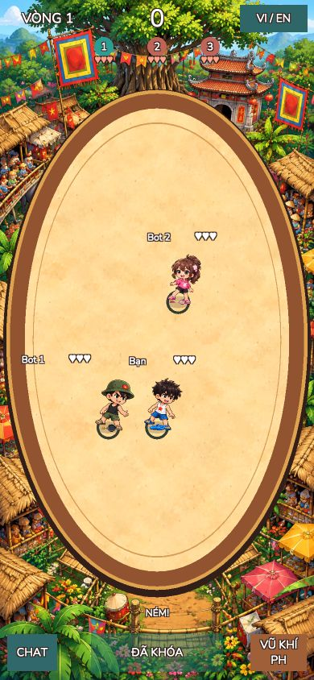
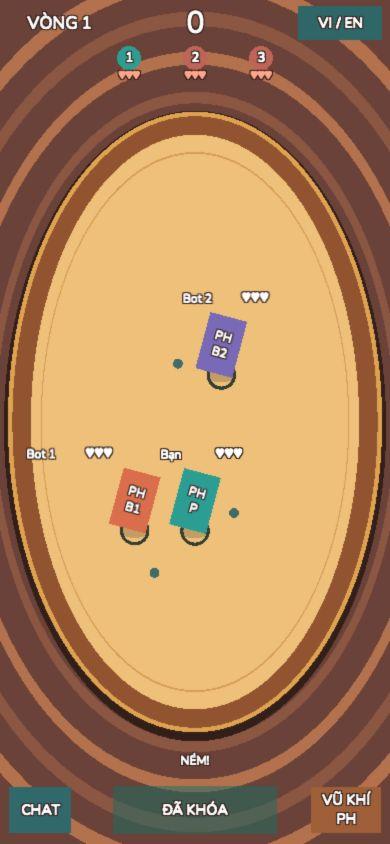

# Cập nhật tích hợp art — 2026-10-08

Đã tạo và import **3 PNG Idle nhân vật + 3 PNG vũ khí**, bằng built-in image_gen theo concept người dùng phê duyệt. Ba nhân vật Battle dùng sprite thật, không còn hình chữ nhật PH khi asset hợp lệ. Bộ này là 6 ảnh riêng; không cắt bảng concept hoặc giả danh sách animation frame.

- Player: áo trắng, sao đỏ, short/dép xanh.
- Bot nam: mũ xanh, áo đen, short xanh, dép nâu.
- Bot nữ: tóc buộc hoa, hoodie hồng hình thỏ, short đen, dép hồng.
- Vũ khí riêng: dép xanh, chảo, vợt hồng; dùng cùng PNG held cho projectile qua fallback sprite có sẵn.

Mỗi nhân vật chỉ có **một frame Idle**. Aim/Throw/Hit/Eliminated/Victory dùng ảnh Idle và chuyển động phụ/tint của CharacterVisual. Chưa có frame vẽ riêng cho các pose, portrait riêng và icon riêng. Không gọi đây là bộ animation nhiều frame hoàn chỉnh.

## File và import

PNG được lưu tại `unity-client/Assets/HitMe/Art/Characters/{Char01_Player,Char02_BotMale,Char03_BotFemale}/Idle/frame_000.png` và `unity-client/Assets/HitMe/Art/Weapons/{DepToOng,Chao,Vot}/held.png`. Ảnh gốc sinh ra được giữ nguyên; không sửa pixel bằng script. Unity giới hạn kích thước import 512 để giảm texture Web; PPU 100, alpha thật, atlas chứa 6 sprite.

Đã chỉnh definition theo trang phục mới, pivot chân theo ảnh và authored facing (bot nữ hướng trái). Visual scale bù lề trong suốt để chiều cao hình thấy được gần 74px khi đủ khoảng trống. Vũ khí có gripPivot và handAnchor riêng. Prefab được cập nhật Idle references. UI dời nhãn máu phía trên sprite và launcher preview xuống vùng trống; không đổi logic battle, hitbox, AI hoặc scene.

Nguồn và prompt: [SPRINT3A_ART_PROMPTS.json](SPRINT3A_ART_PROMPTS.json). Concept gốc: [Approved-Character-Concept.png](art-reference/Approved-Character-Concept.png). Kích thước/alpha/hash của sáu PNG: [SPRINT3A_ART_ASSETS.json](SPRINT3A_ART_ASSETS.json). Validation: [SPRINT3A_ASSET_VALIDATION.md](SPRINT3A_ASSET_VALIDATION.md).

## Nền Làng quê Bắc Bộ

Theo ảnh arena mới người dùng gửi, đã tạo riêng `Art/Arenas/LangQueBacBo/backdrop.png` và `sand.png`, cùng `Resources/Arenas/LangQueBacBo.asset`. Runtime giữ nguyên ArenaInput/EllipseGraphic; Mask dùng mesh elip hiện có để cắt texture cát. Props trong tranh không trở thành collider. Năm bối cảnh còn lại chỉ được lưu trong `docs/art-reference/Approved-Arena-Concepts.png`, chưa có map chạy hoặc menu chọn map. Prompt: `SPRINT3A_ARENA_PROMPTS.json`.

File mới thêm: `Scripts/UI/ArenaArtDefinition.cs`, `Editor/ArenaArtSetup.cs`, `Scripts/Characters/CharacterAtlasRegistry.cs`; registry nạp atlas qua callback chuẩn Unity. Tham khảo API: https://docs.unity.com/en-us/engine/6000.0/script-reference/unityengine/u2d/spriteatlasmanager/atlasrequested .

Preview player được dịch thấp hơn (demo-only) để ảnh 74px không phủ tâm sân; nhãn máu dời theo chiều cao. Vị trí offline thực vẫn lấy từ match snapshot. Projectile sprite giữ tên nội bộ ProjectilePH để tương thích test cũ; không có PH trên hình khi ảnh hợp lệ.

## Kiểm thử bản có sprite

**Bản có sprite và nền mới:** EditMode **51/51 PASS**, PlayMode **11/11 PASS**, gồm toàn bộ test Sprint 1/2 giữ nguyên và chạy lại tại 360×800, 390×844, 412×915, 430×932. Hai lỗi ban đầu liên quan probe tâm sân bị sprite preview phủ và tên projectile được giải quyết trong phần presentation; không sửa test cũ. Cảnh báo atlas được giải quyết bằng callback tải atlas, không bỏ qua LogAssert.

Bằng chứng mới: [EditMode XML](sprint3a-art-EditMode-results.xml), [PlayMode XML](sprint3a-art-PlayMode-results.xml), [Game View sprite + Làng quê](screenshots/Sprint3A-Battle-Sprites.png). Đã cập nhật mục Art/audio trong `MISSING_REQUIREMENTS.md`; các luật mở giữ nguyên. File delta giai đoạn art: [SPRINT3A_ART_FILES.tsv](SPRINT3A_ART_FILES.tsv). Kiểm tra hash: nguyên 48 file Phaser/TypeScript, core/bot/resolver/scenes/settings/test cũ; chỉ ba file UI và tài liệu provenance Art/LICENSES.md thay đổi so với baseline Sprint 2. Không xóa file.

**Web build bản art: Succeeded**, process exit 0, `HITME_WEB_BUILD: Succeeded, bytes=52733824`. [Log build mới](sprint3a-art-WebBuild.log). Đã mở phiên Web mới, vào trận 2 bot từ menu, kéo đặt vị trí/ngắm, khóa hành động và quan sát reveal đủ ba sprite. Canvas thực 390×844. Console warn/error **0** ([snapshot mới](sprint3a-art-WebConsole.json)). Đã quan sát projectile sprite chuyển động trong pha Throw; luồng Result/replay có test PlayMode pass, chưa chạy mọi kịch bản trên trình duyệt/điện thoại thật.

Các kết quả Web ở phần lịch sử bên dưới thuộc mốc fallback trước khi thêm art.

---

# Lịch sử: mốc kiến trúc trước khi có PNG

# HIT ME — Sprint 3A Character & Animation Integration

Ngày kiểm chứng: 2026-10-08. Unity 6000.6.4f1, project `unity-client/`.

**Trạng thái lịch sử trước khi người dùng cấp concept và cho phép tạo art:** đã có kiến trúc, khi đó chưa có PNG và dùng PH. Trạng thái hiện tại ở đầu báo cáo.

## 1. File đã tạo và chỉnh sửa

Danh mục đầy đủ mã nguồn/assets/config, gồm Unity `.meta`: [SPRINT3A_FILES.tsv](SPRINT3A_FILES.tsv). Baseline trước Sprint: [SPRINT3A_BASELINE.json](SPRINT3A_BASELINE.json).

Chỉ sửa ba file có sẵn:

- `Assets/HitMe/Scripts/UI/CharacterPresentation.cs`: adapter tương thích API cũ, chuyển tiếp sang CharacterVisual.
- `Assets/HitMe/Scripts/UI/BattleView.cs`: lấy definition/prefab, portrait, bóng chân, fit sprite trong HUD, sắp xếp Y.
- `Assets/HitMe/Scripts/UI/BattleView.Offline.cs`: đọc public snapshot, ánh xạ pose/facing/HP/elimination/winner; chọn sprite vũ khí; giữ đường projectile từ resolver. Sửa một chuỗi dấu phân cách bị lỗi encoding.

Đường dẫn trên tính từ `unity-client/`. File mới chính:

- `Scripts/Characters/CharacterDefinition.cs`, `WeaponDefinition.cs`, `CharacterCatalog.cs`, `CharacterVisual.cs`.
- `Editor/CharacterPngImporter.cs`, `CharacterAssetPipeline.cs`.
- Ba character definition, ba weapon definition trong `ScriptableObjects/Characters/`.
- Ba prefab trong `Prefabs/Characters/`; catalog trong `Resources/Characters/`.
- `Art/Characters/HitMeCharacters.spriteatlas`, các thư mục nhập ba nhân vật/sáu trạng thái và ba vũ khí; thư mục `Animations/Characters/`.
- `Tests/CharacterEditMode/CharacterAssetTests.cs` và asmdef; `Tests/PlayMode/CharacterVisualTests.cs`.
- `tools/character-assets.ps1`, `tests/verify-sprint3a.py` tại root.
- Tài liệu mới: báo cáo này, `SPRINT3A_CHARACTER_ASSET_GUIDE.md`, `SPRINT3A_ASSET_VALIDATION.md`, baseline/inventory, `SPRINT3A_SOURCE_HASHES.json`, XML kết quả test, log Web build và ảnh minh chứng; README trong thư mục art.

Không sửa core, bot AI, combat resolver, radius, hệ tọa độ, scene, package/config, test Sprint 1/2 hoặc Phaser/TypeScript. Không thêm CharacterController gameplay. `HitMe.Characters.CharacterDefinition` là SO mới; kiểu legacy cùng tên trong namespace `HitMe.UI` giữ nguyên để tương thích.

## 2. Asset import thành công và asset còn thiếu

Unity Editor đã tạo/đọc thành công 3 character definition, 3 weapon definition, 3 prefab, catalog và atlas rỗng. **PNG production hợp lệ: 0. AnimationClip từ art thật: 0.** Xem [kết quả validation](SPRINT3A_ASSET_VALIDATION.md).

Cần tối thiểu ba PNG riêng:

- `Art/Characters/Char01_Player/Idle/frame_000.png`: nam tóc đen, áo ba lỗ trắng, short xanh, dép xanh.
- `Art/Characters/Char02_BotMale/Idle/frame_000.png`: nam đội mũ lưỡi trai, trang phục đời thường.
- `Art/Characters/Char03_BotFemale/Idle/frame_000.png`: nữ tóc buộc, trang phục thể thao.

Cần thêm portrait riêng mỗi nhân vật; held weapon cho `DepToOng`, `Chao`, `Vot`; các frame thật của Aim/Throw/Hit/Eliminated/Victory nếu muốn animation nhiều frame. Projectile và icon riêng còn thiếu; projectile có thể dùng held sprite thật. Chi tiết tên file, pivot và import: [hướng dẫn asset](SPRINT3A_CHARACTER_ASSET_GUIDE.md).

Không cắt concept tổng hợp, không sinh sprite nhân vật bằng C#, không giả frame. Test importer dùng swatch RGBA 2×2 tạm thời, dọn sau test; swatch runtime chỉ tồn tại trong RAM. Chúng không được tính là art đã bàn giao.

## 3. Animation và tích hợp

CharacterVisual hỗ trợ Idle, Aim, Throw, Hit, Eliminated, Victory. Pose phản ánh snapshot của OfflineMatch; hướng ngắm đối thủ chỉ lấy khi public action có sẵn. HP giảm kích hoạt Hit; HP=0 chuyển Eliminated; winner chuyển Victory trong RoundResult trước Result scene. Không quyết định hit/damage từ animation.

Frame player dùng frame/FPS trong definition. Pipeline chỉ tạo clip từ ít nhất hai frame PNG thật. Với một Idle sprite thật, các pose thiếu dùng chuyển động phụ xoay/nhún nhẹ và flash Hit. Hiện fallback nhận đủ sáu trạng thái; đường sprite/frame/facing/weapon đã được kiểm thử bằng fixture, chưa nghiệm thu thẩm mỹ với art thật.

Pivot visual ở chân, body con riêng với FeetHitbox. Chiều cao tham chiếu 74 tại Canvas 390×844, thu nhỏ khi sát HUD; có shadow elip, lật trái/phải và sibling sort theo Y chân. Hitbox logic 90 và projectile radius 30 giữ nguyên. Prefab không chứa collider/controller gameplay mới.

## 4. Unity Editor và kết quả test

Editor hoạt động. Battle được load/chạy bởi Unity Test Runner, có ảnh Game View thật. Không có unexpected Console error trong các test hoàn tất.

| Kiểm tra đã chạy | Kết quả |
|---|---|
| EditMode, gồm toàn bộ 49 test cũ + 2 test asset mới | **51/51 PASS** |
| PlayMode, gồm toàn bộ 8 test cũ + 3 test visual mới | **11/11 PASS** |
| Viewport 360×800, 390×844, 412×915, 430×932; inset giả lập và vị trí sát biên | PASS trong các test PlayMode cũ chạy lại |
| Ba definition/renderer trong Battle; chân/ring giữ nguyên | PASS |
| Flip, frame sampling, weapon visibility, sáu pose không đổi transform hitbox | PASS với fixture runtime |
| Combat snapshot → Throw/Hit/Eliminated/Victory | PASS |
| Import PNG Single, PPU 100, pivot tùy chỉnh được giữ qua reimport, clip refs thật, reject opaque/empty | PASS |
| `python tests/verify-prototype.py` | 48/48 file prototype nguyên byte; không thêm file apps/packages |
| `python tests/verify-sprint3a.py` | Chỉ 3 file UI cũ đổi; core/scenes/settings/test cũ nguyên vẹn |
| `python tests/verify-fonts.py` | 46 key/ngôn ngữ và ký tự tim được font hỗ trợ |

Bằng chứng: [EditMode XML](sprint3a-EditMode-results.xml), [PlayMode XML](sprint3a-PlayMode-results.xml). Lần PlayMode đầu 10/11 do test tìm bot chỉ trong active objects khi bot đang ẩn; đã sửa test tìm cả inactive rồi chạy lại 11/11. Không sửa privacy để làm test pass. Test kiểm tra pivot được bổ sung sau khi phát hiện importer ghi đè custom pivot; EditMode chạy lại 51/51.

Không dùng `verify-sprint2.py` để xác nhận Sprint 3A vì allowlist lịch sử của nó không bao gồm thay đổi UI mới; toàn bộ Unity tests Sprint 1/2 vẫn được chạy nguyên bản.

## 5. Web Build

**Succeeded**, Unity process exit 0, `HITME_WEB_BUILD: Succeeded, bytes=46768867`. Output: `unity-client/Builds/Web/`. Log: [sprint3a-WebBuild.log](sprint3a-WebBuild.log). Log startup có thông báo refresh licensing access token unavailable; Editor tiếp tục với license hiện có và hoàn tất build thành công.

Đã reload bản mới tại `http://127.0.0.1:8790/`, viewport 390×844. Kiểm tra thực tế Boot/menu → trận 2 bot → kéo đặt vị trí/hướng → SẴN SÀNG → reveal/Throw với ba fallback và projectile, tiếp tục vòng mới. Console snapshot warn/error: **0** ([sprint3a-WebConsole.json](sprint3a-WebConsole.json)). Không ghi nhận MissingReference trong lượt kiểm tra. Luồng Result/replay được kiểm chứng trong PlayMode; không gọi smoke test trình duyệt ngắn này là kiểm chứng đầy đủ mọi trận hoặc thiết bị mobile thật.

## 6. Ảnh thực tế

Ảnh Web thật 390×844, vòng 1 pha Throw: player và hai bot, bóng chân/hitbox, projectile và HUD. Đây là bằng chứng runtime, không phải concept hoặc art hoàn chỉnh.

[Game View Battle fallback](screenshots/Sprint3A-Battle-Fallback.png) — Unity PlayMode, 430×932, vẫn là PH. Ảnh này là preview bố cục; nút launcher CHƠI VỚI BOT sẵn có nằm trên vùng giữa sân. Dùng trận offline để xem bố cục không có launcher. Không coi đây là ảnh nhân vật chibi hoàn chỉnh.

## 7. Cách mở và chạy

Mở Unity Hub > Add project from disk > `D:/HIT ME/unity-client`, dùng Unity 6000.6.4f1. Mở `Assets/HitMe/Scenes/Battle.unity`, bấm Play rồi CHƠI VỚI BOT. Hoặc mở Boot và đi từ menu vào trận offline. Import art bằng **HIT ME > Characters > Import and Validate Library**; không cần viết lại Battle scene.

## 8. Việc tiếp theo và giới hạn

Bổ sung PNG riêng theo guide, chạy pipeline, kiểm tra báo cáo missing/rejected, kiểm tra pivot/hand anchor và hình ảnh ở bốn viewport rồi build lại. Chưa có nghiệm thu art thật, atlas packing với bộ art production, Safari iOS/Chrome Android trên máy thật, hay benchmark FPS/memory. PNG thiếu không chặn trận offline fallback hiện tại.

Các luật chưa chốt trong `MISSING_REQUIREMENTS.md` vẫn giữ nguyên: timeout đề xuất, overlap/nudge, sudden death, Hard bot; không suy đoán thêm và không thêm multiplayer online. Art/audio vẫn thiếu như tài liệu ghi nhận.
